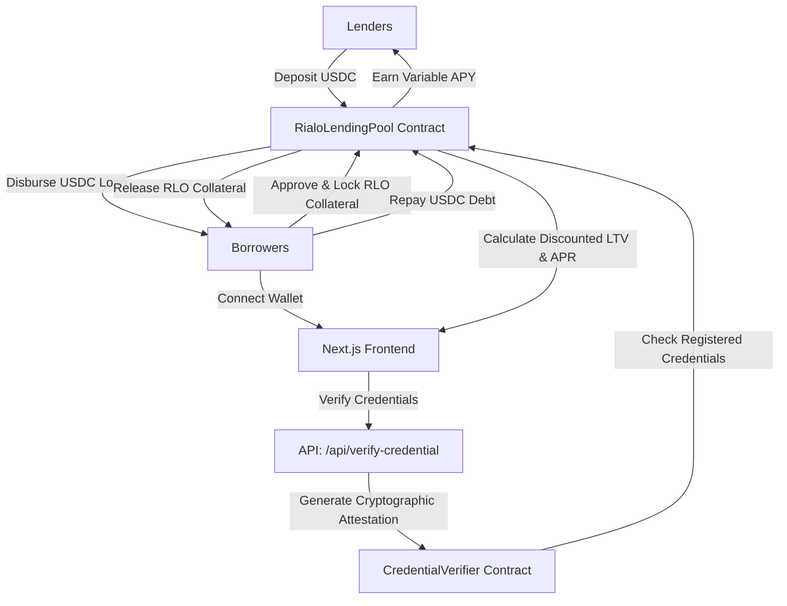

# Maye: Lending Protocol w/ Onchain Private Credit

Maye is a premium, privacy-preserving consumer lending interface deployed on the **Base Sepolia Testnet**. By integrating cryptographically signed credentials verified on-chain, Maye allows borrowers to unlock dynamic, under-collateralized loans. 

Instead of absolute over-collateralization typical in standard DeFi (fixed 150%), Maye enables borrowers to lower their required Loan-to-Value (LTV) ratio down to **67%** and interest rates down to **7.4%** by proving their real-world creditworthiness privately.

---

## 📐 Architecture & Mechanics

Maye integrates on-chain capital allocation with cryptographic attestations via a dual-token under-collateralized pool:



### Protocol Calculations:
* **Base Collateral Ratio:** 150% (Standard DeFi).
* **Discount System:**
  * **Credit Score Attestation:** -25% Collateral | -1.8% Interest APR
  * **Banking Asset Verification:** -20% Collateral | -1.2% Interest APR
  * **KYC / Legal Identity Check:** -15% Collateral | -0.8% Interest APR
  * **On-Chain Repayment History:** -10% Collateral | -0.6% Interest APR
  * **Default Reporting Consent:** -8% Collateral | -0.4% Interest APR
  * *Combo Bonus (5/5 verified):* -5% Collateral | -0.3% Interest APR
* **Max Discounted Collateral Ratio:** 67% (Under-collateralized borrowing).
* **Min Interest Rate:** 7.4% APR (Base rate is 12.5% APR).

---

## 🛠️ Technology Stack

* **Frontend Framework**: Next.js 16 (using Turbopack) & React 19
* **Styling**: Tailwind CSS v4 & Vanilla CSS (Editorial Minimalism)
* **Web3 Integration**: Wagmi v2, RainbowKit v2, Viem v2
* **Smart Contracts**: Solidity `^0.8.28`, Foundry (Forge + Cast)
* **Network & RPC**: Base Sepolia

---

## 📂 Project Structure

```
maye/
├── src/                          # Next.js 16 Web Application
│   ├── app/                      # App Router pages & APIs
│   │   ├── api/                  # API routes (zk-credentials verifications)
│   │   ├── apply/                # Unified borrowing apply flow
│   │   ├── dashboard/            # Borrower command center
│   │   ├── lend/                 # Lender deposit/withdraw panel
│   │   └── page.tsx              # Homepage
│   ├── components/               # React UI components (shadcn/ui layout)
│   ├── hooks/                    # Custom Web3 hooks (useContracts, usePortfolioSummary)
│   └── lib/                      # Providers & Utils (Theme, Wallet, Toast, math pricing)
├── contracts/                    # Solidity Smart Contracts
│   ├── Tokens/                   # MockRLO (collateral) & TestUSDC (lending asset)
│   ├── RialoLendingPool.sol      # Core lending/borrowing pool logic
│   └── CredentialVerifier.sol    # Credential attestations storage
├── test/                         # Smart Contract Tests (Forge Suite)
│   └── Rialo.t.sol               # Deposit, borrow, repayment, and liquidation tests
├── scripts/foundry/              # Deployment and setup scripts
└── foundry.toml                  # Foundry configurations
```

---

## ⚡ Getting Started & Local Installation

### Prerequisites
* **Node.js**: `v20` or higher
* **Git**: Installed
* **Foundry** (Optional, for smart contract development): Install via `curl -L https://foundry.paradigm.xyz | bash` followed by `foundryup`

### 1. Installation
Clone the repository and install the frontend dependencies:
```bash
git clone https://github.com/stlkrdumb/maye.git
cd maye
npm install
```

### 2. Configuration
Create a `.env` file in the root directory:
```bash
cp .env.example .env
```
Ensure the environment variables are set correctly:
* `NEXT_PUBLIC_RPC_URL`: RPC URL for Base Sepolia (or your local node).
* `NEXT_PUBLIC_CHAIN_ID`: `84532` (Base Sepolia).
* `DEPLOYER_PRIVATE_KEY`: Deployer wallet private key (for deploying/funding scripts).

### 3. Run Local Dev Server
Start the Next.js development server:
```bash
npm run dev
```
Open [http://localhost:3000](http://localhost:3000) to view the web application.

### 4. Smart Contract Development & Testing (Foundry)
To build and test the Solidity contracts locally:
```bash
# Compile contracts
forge build

# Run tests
forge test -vv
```

---

## 📖 Step-by-Step User Tutorial

To fully experience the borrow, lend, and credit verification system on the Base Sepolia Testnet, follow these steps:

### Step 1: Connect Wallet & Get Faucets
1. Open the Maye application and click **Connect Wallet** in the top navigation.
2. In the **Lend** page or **Apply** page checkout, use the integrated faucets to mint:
   * **Test USDC**: Claims mock USDC to deposit or repay loans.
   * **Mock RLO**: Claims mock RLO tokens to lock as borrowing collateral.

### Step 2: Verify Credentials (Build Your Trust Profile)
1. Go to the **Apply** section from the homepage or navigation.
2. Under **Step 1: Trust & Identity Check**, click **Verify** on the available credentials:
   * Credit Score Bureau Attestation (Bureau API validation)
   * Banking Asset Verification (Open-banking payload verification)
   * KYC / Legal Identity Check (Government ID cryptographic attestation)
   * On-Chain Repayment History (Base Sepolia historical trace scan)
   * Default Reporting Consent (Cryptographic Consent Attestation)
3. Notice how each verified credential dynamically reduces your **Required LTV Ratio** (from 150% down to 67%) and **Active Borrow APR** (from 12.5% down to 7.4%).

### Step 3: Configure Borrowing Terms & Borrow USDC
1. Click **Configure Borrowing Terms**.
2. Adjust the sliders to set your desired **USDC Borrow Amount** and **Loan Duration (Days)**.
3. Review the **Capital Saved** card, which shows how much collateral you are saving compared to standard over-collateralized DeFi protocols.
4. Click **Proceed to Checkout**.
5. Click **Approve RLO** to authorize the contract, then click **Confirm & Borrow**. Once mined, the USDC will be in your wallet.

### Step 4: Monitor and Repay on the Dashboard
1. Open the **Dashboard** page.
2. View your **Portfolio Health** factor percentage:
   * **Green ($\ge 115\%$):** Safely collateralized.
   * **Yellow ($100\% - 115\%$):** Warnings boundary, close to liquidation.
   * **Red ($< 100\%$):** Critical/liquidable.
3. Review your **Active Borrow Positions** listing.
4. To close a loan and release your locked RLO, click **Repay Debt** on the loan card. You will approve USDC spending and pay off the outstanding balance (accrued principal + interest).

### Step 5: Lend and Earn APY
1. Navigate to the **Lend** page.
2. Enter an amount of USDC and click **Deposit**.
3. Your deposits supply liquidity for active borrowers and earn a variable APY based on utilization.
4. Withdraw your assets at any time subject to pool liquidity.

---

## 📄 License
This project is licensed under the MIT License. See [LICENSE](LICENSE) for details.
